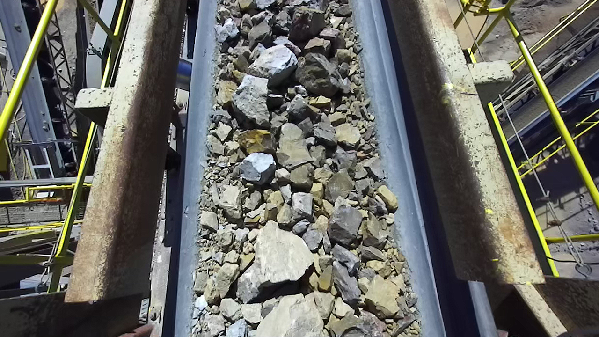
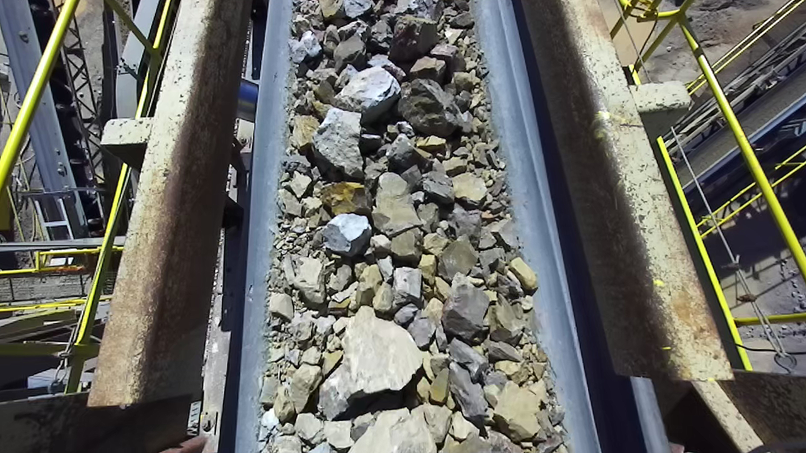
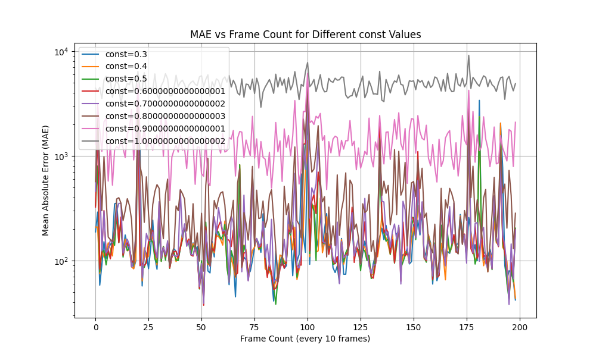

# strayos-belt-speed


## Overview
This script measures the speed of a conveyor belt carrying debris using a 760p60fps ZED camera. It utilizes the ZED SDK, OpenCV, NumPy, and Matplotlib to process video frames and calculate the speed of objects moving on the conveyor belt.

Sample images taken for left and right cameras

<p align="center">
  
  
</p>




## Prerequisites
- Python 3.8
- ZED SDK 4.x
- OpenCV (`cv2`) library
- NumPy (`numpy`) library
- Matplotlib (`matplotlib`) library
- A 760p60fps ZED camera

## Installation
1. Ensure Python 3.8 is installed on your system.
2. Install the ZED SDK version 4.x from the [StereoLabs website](https://www.stereolabs.com/developers/).
3. Install the required Python libraries:
   ```
pip install opencv-python numpy matplotlib
```

## Usage
Run the script using Python:
`python main.py [OPTIONS]`
The script will start processing the video feed from the recorded SVO video file and measure the speed of the conveyor belt for each frame.

## The script accepts several command-line arguments for customization:

--feature_extractor: Feature extractor to use (default is SIFT(Scale Invariant Feature Transform)).
--SIFT_window_size: Window size within which features are extracted.
--matcher: Feature matching algorithm (KNN or Brute-force).
--viz: Enable visualization of feature extraction and matching.
--const: Distance ratio test threshold for good matches.
--threshold: Multiplier for the interquartile range for outlier detection.
--window_size: Number of recent readings to consider for outlier detection.
--include_median_speed: Flag to include median value instead of outlier into the data.
