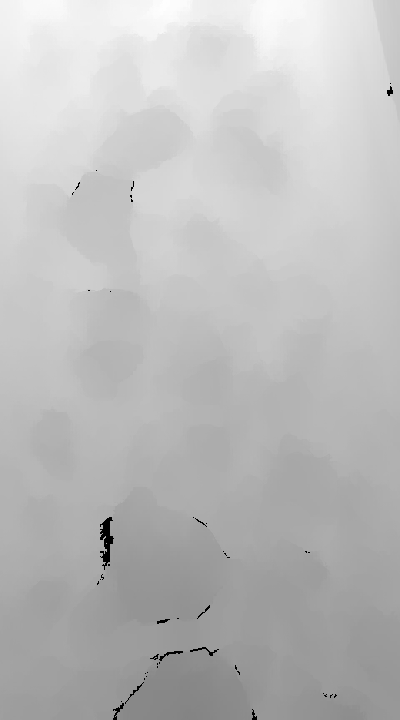

# strayos-belt-speed


## Overview
This script measures the speed of a conveyor belt carrying debris using a 760p60fps ZED stereo camera. It utilizes the ZED SDK, OpenCV, NumPy, and Matplotlib to process video frames and calculate the speed of objects moving on the conveyor belt.

Sample images (Frame captured on left camera and corresponding depth)
<p align="center">
  
  
</p>


## Procedure:
The script follows these steps to compute the speed of the conveyor belt:


1. **Initialization**: The script starts by initializing the ZED camera using the ZED SDK and loads video frames sequentially. It sets up the camera parameters and checks if the correct version of the SDK is being used.

2. **Feature Extraction**: Using the Scale-Invariant Feature Transform (SIFT) method or a specified alternative, the script extracts features and corresponding keypoints from the video frames. The features represent distinct points or characteristics in the image of the conveyor belt.

      **Note:** To improve the computation speed and reduce noise in detected features only a patch of image is considered based on `--SIFT_window_size` parameter that is default to be `([510,250],[700,400]) `.

3. **Feature Matching**: Features from consecutive frames are matched to track the movement of points across frames. This process uses the KNN (k-Nearest Neighbors).

    **Note:**  A parameter `--const` is used for distance ratio test threshold for good matches (Refer to const vs MAE graph below) to select best `--const` value, Brute Force Extraction will be implemented in the further development.

4. **Coordinate Transformation**: The script then transforms image coordinates to world coordinates. This step is crucial for calculating the actual distance moved by points on the conveyor belt in the real world.

   **Note:** For reliable estimate all the three coordinates (X, Y , Z) are considered for displacement measurement.

6. **Speed Calculation**: The speed of the conveyor belt is calculated based on the displacement of matched points in world coordinates and the time elapsed between frames.

   **Note:** For speed estimate a constant interval (of 1/60 sec) is considered between frames.


7. **Outlier Detection and Noise Removal**: To improve accuracy, the script includes outlier detection. It uses the interquartile range method to identify and exclude any abnormal speed readings that might skew the results.

   **Note:** The parameters `--window_size` (default: 100) is used to find the number of recent readings to consider for outlier detection and the parameter `--threshold` for adjusting the outlier sensitivity.

8. **Zero speed detection**: zero speed detection is based on adaptive threshold that returns based on `--adaptive_threshold_window` 's (default: 30) standard deviation values measured. `--near_zero_base_threshold` (default: 10) is base threshold to consider it as a zero speed

9. **Result Output**: Finally, the script outputs the calculated speed of the conveyor belt for each frame, along with the corresponding timestamp, and saves this data to a CSV file.

<br>

**Assumptions:** Features captured are mostly from the rocks because of the variablity nature across the image, and the rocks are assumed to be stationary when moving on conveyor. (i.e sufficient friction is expected to be present on the conveyor belt to avoid slipping).


<b>Following is the graph between frequency and velocity distrbution (velocity printed on top of bars), we can observe that max count edge value to be <b>1526 mm/sec</b> for 50 bins which is close to true value of 1500 mm/sec with IQR determined on a range of 100.</b>

<br>


<br>


<br>
Following are the speeds captured after removing outliers through `--window_size` of 30 frames, 100 frames, 200 frames and No outlier removal.
<br>
Mean speeds Generated for different `--window_size` are 1708 mm/sec for 30 frames, 1640 mm/sec for 100 frames, 1675 mm/sec for 200 frames and over 1798 mm/sec for no outlier removal.
hence a `--window_size` of 100 is considered.

<br><br>
<p align="center">
  
  
  
  
</p>


Following is the graph between MAE (Mean Absolute Error) evalated for 10 frames (assuming true speed to be 1500 mm/sec) and finalised on the `--const` parameter to be 0.7.
<br>

<br>


## Prerequisites
- Python 3.8
- ZED SDK 4.x
- OpenCV (`cv2`) library
- NumPy (`numpy`) library
- Matplotlib (`matplotlib`) library
- A 760p60fps ZED camera

## Installation
1. Ensure Python 3.8 is installed on your system.
2. Install the ZED SDK version 4.x from the [StereoLabs website](https://www.stereolabs.com/developers/).
3. Install the required Python libraries:
```pip install opencv-python numpy matplotlib```
4. ```git clone https://github.com/saikrishna-prathapaneni/strayos-belt-speed.git```
    

## Usage
Run the script using Python:
`python main.py [OPTIONS]`
The script will start processing the video feed from the recorded SVO video file and measure the speed of the conveyor belt for each frame.

## The script accepts several command-line arguments for customization:

--feature_extractor: Feature extractor to use (default is SIFT(Scale Invariant Feature Transform)).<br>
--SIFT_window_size: Window size within which features are extracted.<br>
--matcher: Feature matching algorithm (KNN or Brute-force).<br>
--viz: Enable visualization of feature extraction and matching.<br>
--const: Distance ratio test threshold for good matches.<br>
--threshold: Multiplier for the interquartile range for outlier detection.<br>
--window_size: Number of recent readings to consider for outlier detection.<br>
--include_median_speed: Flag to include median value instead of outlier into the data.<br>
--adaptive_threshold_window: window of values for adaptive threshold, if the frame captures zero or near zero value.<br>
--near_zero_base_threshold: near zero base threshold below which we consider it as a zero.<br>

## Further Considerations and Future Development

1. **Kalman Filter**: In the current implementation for noise handling, a computationally low-intensive IQR method is employed. Further improvement in noise handling is being pursued through the development of a Kalman filter for more accurate speed estimation.

2. **Exponential Moving Average (EMA)**: To enhance the algorithm's speed, a simpler EMA can be utilized to reduce outliers.

3. **Block Matching**: Employing a sliding window algorithm, such as Block Matching, can enhance the accuracy of features by matching selected blocks in consecutive frames.

4. **Iterative Closest Point (ICP)**: The Iterative Closest Point algorithm, while computationally intensive, can be employed to compute the alignment between point clouds of two adjacent frames. Although this is a more resource-intensive process, it provides a better estimate of speed.

5. **Circular Buffer for speeds list**: The speeds list grows exponentially as the video length grows, hence a circular buffer (deque) should be implemented.

6. **Zero speed detection**: here a simple dynamic thresholding technique is employed to find the zero speed of the conveyor belt, a much more efficient solution based on z score could be employed here for robust detection.
